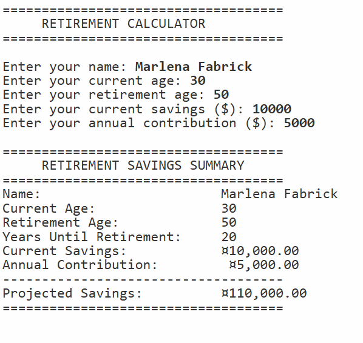

# 💰 Retirement Calculator

A C# (.NET Core 3.1) console application that estimates retirement savings
based on a person's current age, retirement age, current savings, and annual
contribution. The program demonstrates object-oriented design with a `Person`
model class and a `Program` runner class.

---

## 📋 Features

- Collects the user's name, current age, retirement age, current savings,
  and annual contribution
- Validates all input — re-prompts instead of crashing on bad input
- Rejects empty names, ages out of range, and negative dollar amounts
- Ensures retirement age is always greater than current age
- Calculates years until retirement and projected savings automatically
  using computed properties in the `Person` class
- Displays a clean, column-aligned retirement savings summary

---

## ⚙️ How It Works

1. The user enters their personal and financial details
2. All inputs are validated before being accepted
3. A `Person` object is created storing all the data
4. The `Person` class automatically computes `YearsUntilRetirement`
   and `ProjectedSavings` using read-only computed properties
5. A formatted summary is printed to the console

### Projected Savings Formula
```
Projected Savings = Current Savings + (Annual Contribution × Years Until Retirement)
```

---

## 💡 Example Output

```
====================================
     RETIREMENT CALCULATOR
====================================

Enter your name: Maria
Enter your current age: 30
Enter your retirement age: 65
Enter your current savings ($): 10000
Enter your annual contribution ($): 5000

====================================
     RETIREMENT SAVINGS SUMMARY
====================================
Name:                       Maria
Current Age:                   30
Retirement Age:                65
Years Until Retirement:        35
Current Savings:          $10,000.00
Annual Contribution:       $5,000.00
------------------------------------
Projected Savings:        $185,000.00
====================================
```

---

## 🛠️ Technologies Used

| Technology          | Purpose                                           |
|---------------------|---------------------------------------------------|
| C# 8.0              | Core programming language                         |
| .NET Core 3.1       | Runtime framework                                 |
| OOP / Model Class   | `Person` class encapsulates data and calculations |
| Computed Properties | `YearsUntilRetirement` and `ProjectedSavings`     |
| `int.TryParse`      | Safe integer input validation                     |
| `double.TryParse`   | Safe decimal input validation                     |
| String Formatting   | Column-aligned summary output                     |

---

## 🎓 Learning Outcomes

- Designing a model class with properties and a parameterized constructor
- Using computed properties (`=>`) to derive values from existing data
- Separating concerns between a model class (`Person`) and a runner
  class (`Program`)
- Validating user input with `TryParse` and range checks
- Looping on invalid input to re-prompt the user
- Formatting console output with fixed-width columns using composite
  string formatting

---

## 📁 Folder Structure

```
E2-retirement-calculator/
├── Program.cs       ← Runner — collects input and displays summary
├── Person.cs        ← Model class with properties and computed values
└── E2-retirement-calculator.csproj    
├── E2-retirement-calc-output.png   ← Console output screenshot
├── .gitignore
├── LICENSE
└── README.md
```

---

## 🚀 How to Run

### Prerequisites
- [.NET Core 3.1 SDK](https://dotnet.microsoft.com/download/dotnet/3.1)

### Steps

```bash
# Clone the repository
git clone https://github.com/MissMarzelous/E2-retirement-calculator.git

# Navigate into the project folder
cd E2-retirement-calculator/E2-retirement-calculator

# Run the application
dotnet run
```

---

## 📸 Screenshots

### Console Output



---

## 👩‍💻 Author

**MissMarzelous** — C# .NET Core student project
